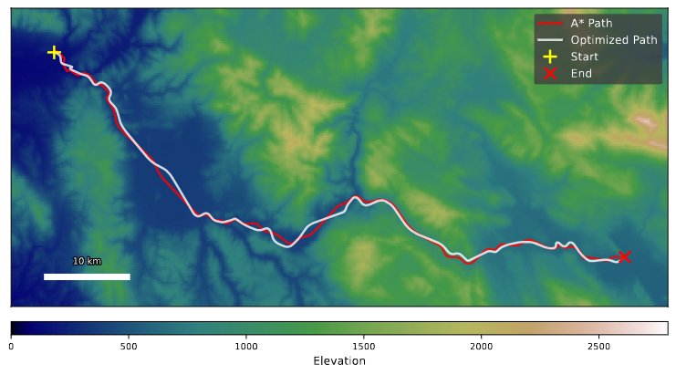
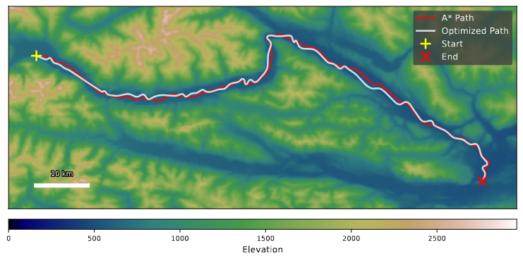

# Hybrid Optimization of Horizontal Alignments in European Terrains: A Comparative Study

## Abstract
<p align="justify">Path planning across terrain is a fundamental challenge in civil engineering, with applications ranging from transportation infrastructure to urban development. Recent advances in computational methods have enabled automated route optimization, particularly in horizontal alignment problems that balance construction costs with terrain constraints. However, standardized comparisons of optimization approaches across diverse geographical contexts remain limited, hindering the development of reliable automated planning systems. Here we show through a systematic comparative study across three European landscapes that A* significantly outperforms RRT* in initial path generation, with better computational efficiency and terrain adaptation, while PSO demonstrates superior optimization capabilities compared to CMA-ES and DE in refining these paths against roadway construction criteria. Through extensive parameter validation, we find these performance advantages remain consistent across different geographical contexts and topographical challenges, with the hybrid A*-PSO approach achieving significantly better results than applying optimization algorithms to straight-line paths alone. These findings provide a comprehensive comparison of key algorithms in infrastructure planning optimization, demonstrating the relative strengths of different approaches in horizontal alignment tasks. This comparative analysis offers practical guidance for algorithm selection while highlighting opportunities for further development through the incorporation of real-world engineering constraints.</p>

## Visualisation

<table>
  <tr>
    <td></td>
    <td></td>
  </tr>
</table>

## Easy Setup

```
docker build -t your_name_of_docker .
docker run -it --rm your_name_of_docker bash
python3 scripts/main.py
```

## Authors

* Ane Espeseth 📫 ane.espeseth@gmail.com
* Martin Juricek 📫 200543@vutbr.cz
* Harald M. Ludwig 📫 ludwig@csh.ac.at
* Tea Tušar 📫 tea.tusar@ijs.si